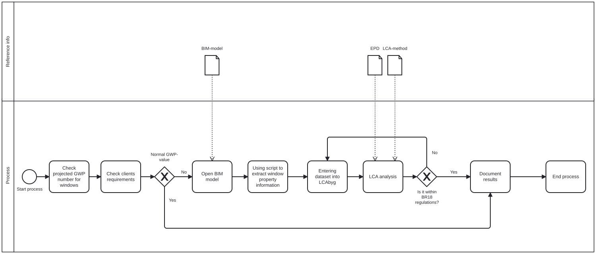

# A2

### About our group
When it comes to programming and coding we feel a 2.

### Identify claim 
We have chosen Building 308 Report 25-08
The claim is to do an LCA on the windows in the building, this is due to the very high GWP gave on windows and curtain walls. Group 25-08 found the GWP for windows and curtian walls to be [0,822 kgCO_2eq/m^2/year], which was the highest og all GWPs for their new building. 

### Use Case 
In order to chech this claim, we would need to know the measurements and materials for all the windows in the building. 

The claim would needed to be checked, under optimising and LCA assesments. I can also be used i energi/dayligt analysis.  

The claim relys on the materials used in the the windows, how many and how big the windows are and what the design of the building will be. 

The Phase is Design

The BIM purpose required is analyse and to realise. 

# BPMN

