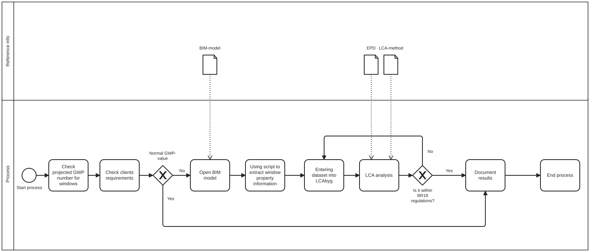
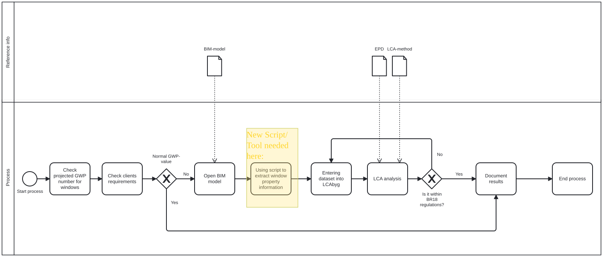
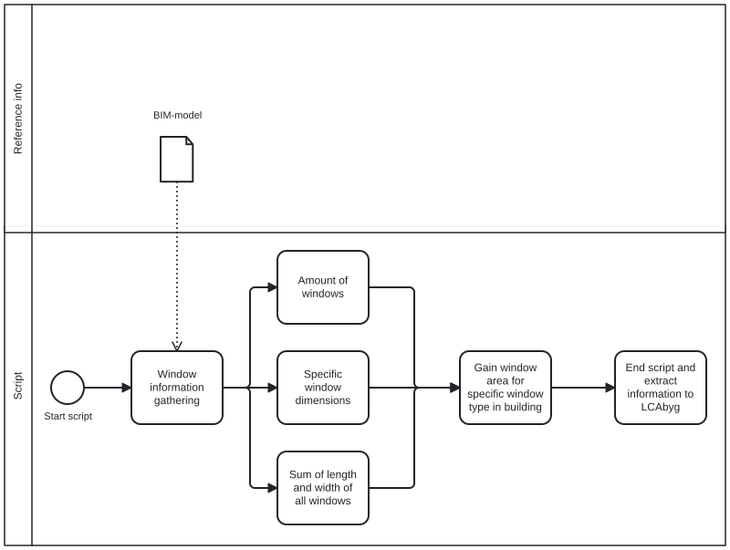

# A2

### About our group
The group consists of 3 people where everyone in the group would consider themselves as a neutral in coding. All members have completed the course basic programming at DTU tho. The total score would therefore be 6. 

### Identify claim 
For this assignment there have been chosen the Building 308 from Report 25-08
The claim is to do an LCA on the windows in the building, this is due to the very high CO2-emission coming from the windows and curtain walls. Group 25-08 found the CO2-emission for windows and curtain walls to be [0,822 kgCO2-eq/m2/year], which was the highest CO2-emission of all of the systems in their building. 

### Use Case 
To check this claim, there would be needed all of the measurements and materials for all of the windows in the building. After gathering information about the materials and measurements of the windows there will be conducted an LCA of the windows.
The claim rely on the materials the windows consists of, how many windows are used, how big the windows are and what the design of the building will end up looking like after the optimization. 
By investigating how big the influence of the window materials and sizes have on the CO2-emission means that this will likely change the design of the building. Meaning that the phase is design.   
In this project would the purpose of the BIM be to gather information about the quantities of the windows, _Analyzing_ the coordinates of the windows and _Realise_ the windows by looking at the materials used and how those are fabricated and assembled to control the regulations regarding the CO2-emission allowed for a building.  

### BPMN
For a better visualization of the processes done to solve this claim, a BPMN-diagram have been made. \
First the claim would be checked and controlled whether or not its ok with the clients requirements. If it isn't then the BIM model would be investigated and to calculate the quantitative of the windows would be done by making a script. After identifying the amount. The data gathered would be exported to LCAbyg to make an LCA analysis. If the project is with the BR18 regulations. Then the project is done. 

### Scope the use case
The implementation of the scripts is happening at the fifth step of the BPMN-diagram and can be seen highlighted on the BPMN-diagram shown below.

With the help of the script and BIM-model it would be possible to calculate the dimensions of a specific window, the amount of windows and the sum of the length and width of all of the buildings. In the future it would also be able to separate indoor windows and outdoor windows. \
With the gathered information it would afterwards be possible to get the sum of the area of all of the windows or specific windows. With this information it would afterwards be imported to LCAbyg where a finalized LCA would be made possible.

### Tool idea
The idea for an OpenBIM ifcOpenSheel Tool would be something compact and manageable, in the industry Revit & DALUX is widely used and the most common program to work with BIM-models. The construction industry isn't very prone to change, so therefore our tool would take a lot of inspiration from these programs both in front- & back-end.

The tool would be cheaper than the current state-of-the-art programs, therefor in regards to the business and societal value the tool would lower the cost of entry, making it more affordable to new or smaller companies, who doesn't have the same capital as larger and more established companies. 

### Information requirements
Since the focus is on windows, they are physically placed in the exterior walls, and to get a better overview of all of the windows, its possible to make a script to isolate this information. \
Even though the group know basic programming it is still known how to get it in ifcOpenShell.

For this to be possible there will be needed information on the, size, placement, thickness of the windows. This is necessary for implementing these results into LCAbyg where the EPDs comes into play and with those a final LCA would be made possible.

### Software license
This is a script that would be great for every company. With the regulations changing all the time it is therefore necessary to also change the script and optimizing it. One of the Software license that does exactly that is the GNU GPLv3 license where it strongly value sharing the work and making the product as good as possible. 

